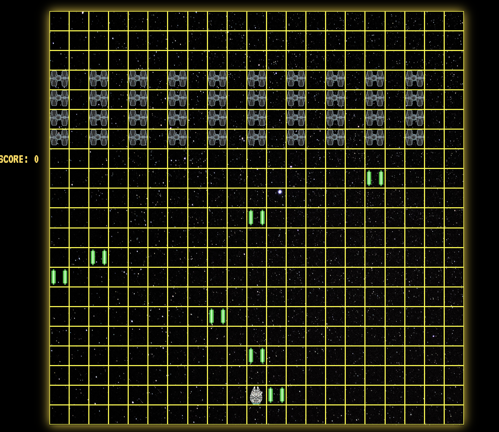
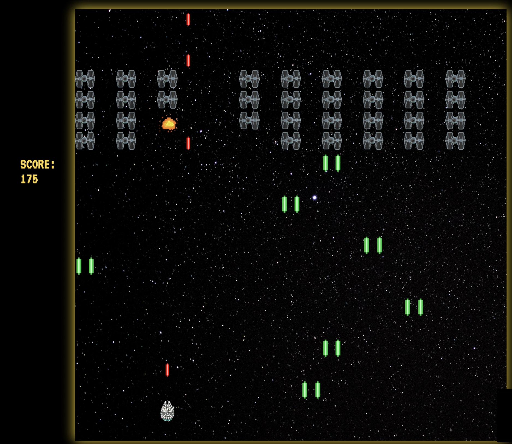
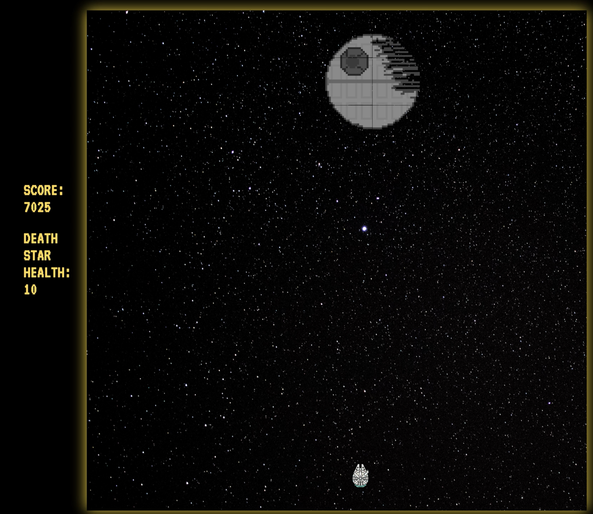
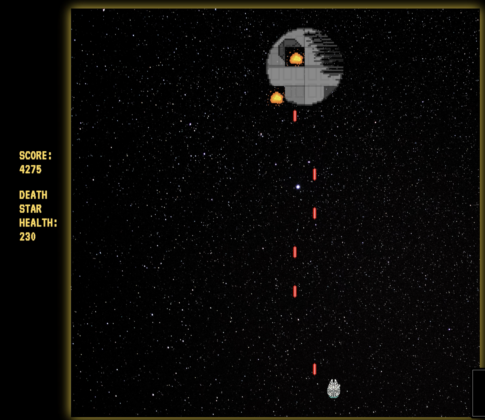

###  General Assembly, Software Engineering Immersive
# SPACE WARS 

## Overview
****Coming soon****


## Brief

- **Render a game in the browser**
- **Design logic for winning & visually display which player won**
- **Include separate HTML / CSS / JavaScript files**
- Stick with **KISS (Keep It Simple Stupid)** and **DRY (Don't Repeat Yourself)** principles
- Use **Javascript** for **DOM manipulation**
- **Deploy your game online**, where the rest of the world can access it
- Use **semantic markup** for HTML and CSS (adhere to best practices)


## The Brief

- **Render a game in the browser**
- **Design logic for winning & visually display which player won**
- **Include separate HTML / CSS / JavaScript files**
- Stick with **KISS (Keep It Simple Stupid)** and **DRY (Don't Repeat Yourself)** principles
- Use **Javascript** for **DOM manipulation**
- **Deploy your game online**, where the rest of the world can access it
- Use **semantic markup** for HTML and CSS (adhere to best practices)


## The Technologies used 

- HTML5
- CSS3
- JavaScript (ES6)
- Git and GitHub
- Google Fonts
- Pixel Art
- GarageBand


## The Approach

### The Grid

The game is built using a grid. A 21 x 21 square is created using JavaScript. HTML divs are created using a for loop and appended as children of the grid.

 ```js
  const width = 21
  const gridSize = width ** 2
  const grid = document.querySelector('.grid')
  let cell = []
  let cells = []
  let player = 409
  let aliens = []
 
 
    if (newGame === true) {
      for (let i = 0; i < gridSize; i++) {
        cell = document.createElement('div')
        grid.appendChild(cell)
        cells.push(cell)
      }
    }
 ```
 
 
 
### Opponent Movement

Enemy ship movement is defined as a global variable of 1. Using a setInterval function, the ships will move 1 space to the right unless other criteria are met. If the right-most alien in the array moves into the defined right wall, then the ships will each move one space down and then continue to move left, until the left-most alien encounters the defined left wall and the movement is mirrored. 

I had originally opted to use an ES6 Array method to cycle through the array of alien positions, but the difficulty I encountered was that this started at the beginning of the array, meaning that rows of ships would disappear as they were being moved down into the ship in front. I corrected this by utilising a for loop to move backwards through the array so that the ships in front moved forward first. 


 ```js
     const alienMovement = setInterval(() => {
      if (gameIsEnding === true || gameOver === true) {
        clearInterval(alienMovement)
        return
      }
      for (let alien = aliens.length - 1; alien >= 0; --alien) {
        cells[aliens[alien]].classList.remove('aliens')
        aliens[alien] += alienMove
        cells[aliens[alien]].classList.add('aliens')
      }

 
      const leftWall = aliens[0] % width === 0


      const rightWall = aliens[aliens.length - 1] % width === width - 1

  
      if ((leftWall && alienMove === -1) || (rightWall && alienMove === 1)) {
        alienMove = width
      } else if (alienMove === width) {
        if (leftWall) alienMove = 1
        else alienMove = -1
      }
      if (aliens.some(alien => alien >= 420)) {
        aliens = 420
        cells[player].classList.remove('player')
        cells[player].classList.add('explosion')
        defeat()
        return
      }
      if (aliens.length === 0) {
        bossBattle()
        clearInterval(alienMovement)
      }
    }, 1000)
 
 
 ```


 

 
 
### 'The Boss'





## Challenges
****Coming soon****


## Victories 
****Coming soon****


## Potential future features
****Coming soon****

## Lessons learned
****Coming soon****
